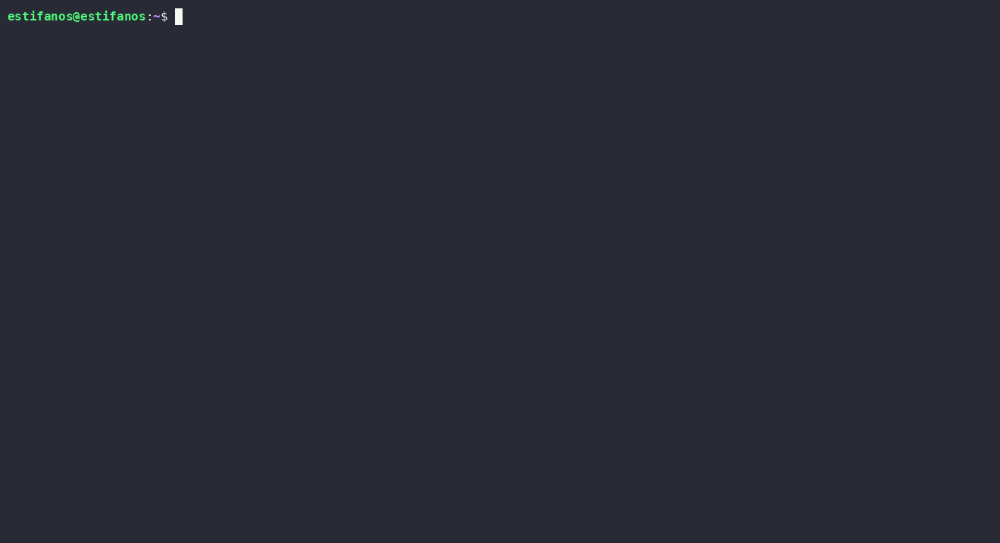

# dotpeek 🔍
> You store dozens of commands in your dotfiles. You forget half of them. dotpeek fixes that.

dotpeek auto-discovers your `.bashrc`, `.zshrc`, and shell config files and gives you a fast, searchable, AI-powered terminal UI to browse everything in one place.

---

## Demo



---

## Install

**Requirements:** Node.js 18+

```bash
git clone https://github.com/estifanosbereket1/dotpeek
cd dotpeek
npm install
npm run build
npm link
```

`npm link` makes `dotpeek` available globally as a command. You only need to do this once.

> **npm package coming soon** — `npm install -g dotpeek` and `npx dotpeek` will work once published.

---

## Get an AI key (recommended)

dotpeek works without AI, but the `a` key (explain command) needs a key to function. **Groq is free and takes about 30 seconds:**

1. Go to **[console.groq.com](https://console.groq.com)** → sign up → API Keys → Create key
2. Open dotpeek, press `k`, select Groq, and paste your key

dotpeek saves it to `~/.config/dotpeek/keys` and loads it automatically from then on. No shell restart needed.

Prefer doing it manually? Add it to your shell instead:

```bash
echo 'export GROQ_API_KEY="your_key_here"' >> ~/.bashrc
source ~/.bashrc
```

---

## Run it

```bash
dotpeek
```

---

## Shell integration

Run once to add `peek` and `ctrl+p` to your shell permanently:

```bash
dotpeek init
```

dotpeek detects your shell, shows you exactly what it will add, asks for confirmation, then appends a small snippet to your `.bashrc` or `.zshrc`.

```bash
source ~/.zshrc     # reload to activate (or open a new terminal)
```

**What you get:**

```bash
peek                  # open dotpeek from anywhere
peek search git       # search directly from the command line
# ctrl+p              # open dotpeek inline at any prompt
```

`ctrl+p` works like a widget — press it at an empty prompt, browse your commands, press `q`, and you're right back where you were with a clean terminal.

**Options:**

```bash
dotpeek init --shell bash          # specify shell explicitly
dotpeek init --shell zsh
dotpeek --shell-snippet            # print the raw snippet (for manual install)
dotpeek --shell-snippet --shell bash
```

---

## Features

- **Auto-discovery** — finds your dotfiles automatically, no config needed
- **Shell integration** — one command adds `peek` and `ctrl+p` to your shell permanently
- **AI explanations** — press `a` on any command to get an instant plain-English description
- **In-app key manager** — press `k` to add, update, or remove AI keys without touching your dotfiles
- **Danger detection** — flags commands with `rm -rf`, `DROP`, `nuke`, and other destructive keywords with ⚠
- **Live search** — fuzzy search across all commands from all files as you type
- **Zero dependencies** — pure Node.js, no runtime `node_modules`

---

## Usage

```bash
dotpeek                        # open interactive browser
dotpeek search deploy          # search from the terminal
dotpeek list                   # list all commands
dotpeek list --type alias      # filter by type: alias | func | export
dotpeek list --danger          # show only dangerous commands
dotpeek files                  # show which dotfiles were discovered
dotpeek init                   # set up shell integration (peek + ctrl+p)
```

---

## Interactive mode

| Key | Action |
|-----|--------|
| `↑↓` | navigate |
| `enter` | expand command |
| `a` | explain with AI |
| `c` | copy command |
| `k` | manage AI keys |
| type anything | live search |
| `tab` | cycle filter: all → alias → func → export → ⚠ danger |
| `esc` | clear search |
| `q` | quit |

---

## AI providers

dotpeek tries these in order and uses the first one available:

| Priority | Provider | How to enable |
|----------|----------|---------------|
| 1 | **Groq** (recommended, free) | press `k` in the app, or `export GROQ_API_KEY="..."` |
| 2 | Claude CLI | install `@anthropic-ai/claude-code` |
| 3 | Gemini CLI | install `@google/gemini-cli` |
| 4 | Anthropic API | press `k` in the app, or `export ANTHROPIC_API_KEY="..."` |
| 5 | OpenAI API | press `k` in the app, or `export OPENAI_API_KEY="..."` |

Keys added via the in-app manager are saved to `~/.config/dotpeek/keys` and take effect immediately — no shell restart required. Results are cached in `~/.dotpeek_ai_cache.json` so the same command is never explained twice.

---

## What it reads

dotpeek auto-discovers these files:

| File | Shell |
|------|-------|
| `~/.bashrc` | bash |
| `~/.bash_profile` | bash |
| `~/.bash_aliases` | bash |
| `~/.zshrc` | zsh |
| `~/.zprofile` | zsh |
| `~/.zshenv` | zsh |
| `~/.aliases` | any |
| `~/.functions` | any |
| `~/.exports` | any |
| `~/.profile` | POSIX |
| `~/.config/fish/config.fish` | fish |

It also scans `~/.dotfiles/`, `~/dotfiles/`, and `~/.config/shell/` for any `*.sh`, `*.bash`, or `*.zsh` files.

---

## What it parses

**Aliases**
```bash
alias gs='git status'
```

**Functions**
```bash
function deploy() {
  git push origin main && ./deploy.sh
}
```

**Exports**
```bash
export EDITOR=nvim
```

Add a comment above any command and dotpeek uses it as the description:

```bash
# Push to main and run deploy script
alias deploy='git push origin main && ./deploy.sh'
```

---

## Roadmap

- [x] Shell integration — `peek` shortcut + `ctrl+p` widget via `dotpeek init`
- [x] In-app AI key manager — add and manage keys without editing dotfiles
- [ ] `dotpeek annotate` — write AI descriptions back into your dotfile as comments
- [ ] Config file at `~/.config/dotpeek/config.toml`
- [ ] `.env` file support
- [ ] Shell completion for `dotpeek search`
- [ ] `npm publish`

---

## Contributing

PRs and issues welcome. Built with TypeScript, zero runtime dependencies.

```bash
git clone https://github.com/estifanosbereket1/dotpeek
cd dotpeek
npm install
npm run build
npm link
dotpeek
```

---

## License

MIT
